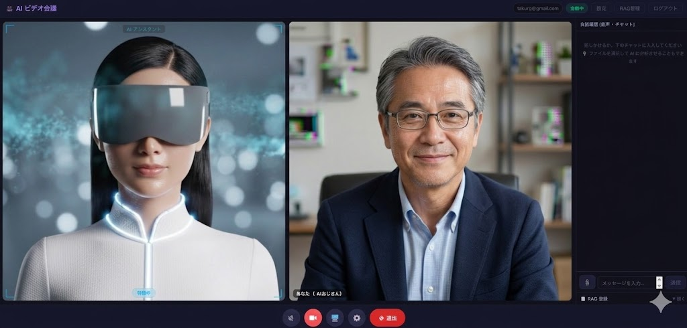
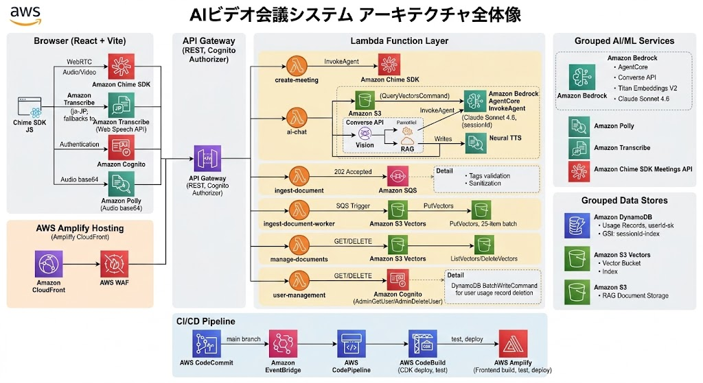

# AI ビデオ会議システム — Amazon Chime SDK × Bedrock AgentCore

Amazon Chime SDK と Amazon Bedrock AgentCore (Claude Sonnet 4.6) を組み合わせた、**話しかけると AI が音声で応答するリアルタイムビデオ会議システム**です。



## 主な機能

| 機能 | 詳細 |
|------|------|
| **AI 会話** | Bedrock AgentCore (Claude Sonnet 4.6) がセッション履歴を自動管理 |
| **音声認識** | Amazon Transcribe (ja-JP) でリアルタイム書き起こし / Web Speech API フォールバック |
| **音声応答** | Amazon Polly Neural TTS (Kazuha) で AI の発話を合成 |
| **RAG** | S3 Vectors + Titan Embeddings V2 + SQS 非同期インジェスト |
| **RAG 管理** | ドキュメント一覧・削除・PDF/テキストファイル登録対応 |
| **画面共有解析** | Canvas JPEG キャプチャ → Bedrock Converse API (Vision) → AgentCore に渡す |
| **カメラ自動認識** | 発話にカメラ関連キーワードが含まれた時のみローカルカメラフレームを AI に送信 |
| **無音検知 UX** | 3 秒無音またはミュート時に確認ダイアログ表示（編集・送信・破棄） |
| **AI アバター** | 動画ループ再生 + CSS AR エフェクト（解析中スキャンライン） |
| **ユーザー管理** | Cognito Admin API によるメール認証・新規登録・アカウント削除 |
| **ビデオ会議** | Amazon Chime SDK でリアルタイムビデオ通話（VoiceFocus ノイズキャンセル） |
| **マイクボタン 4 状態** | ミュート赤 / 聴取中シアン / AI処理中琥珀 / AI発話中 |
| **背景ぼかし** | UserProfile で設定保存 → 次の会議開始時に自動適用 |
| **RAG ユーザー分離** | S3 Vectors クエリを userId でフィルタしてユーザー間のドキュメント漏洩を防止 |
| **テスト** | Vitest 31 件 + Playwright E2E + CDK Jest 53 件 |

## アーキテクチャ



```
ブラウザ (React + Amplify Hosting)
  ├── Amazon Chime SDK JS (ビデオ会議・音声)
  │     └── Amazon Transcribe (書き起こし ja-JP)
  ├── API Gateway (REST + Cognito Authorizer)
  │     ├── POST /meetings        → Lambda: create-meeting → Chime SDK Meetings
  │     ├── POST /ai-chat         → Lambda: ai-chat
  │     │     ├── [frame あり] Bedrock Converse API (Vision) + S3 Vectors RAG を並列実行
  │     │     ├── [frame なし] S3 Vectors RAG のみ (Titan Embeddings V2)
  │     │     ├── Bedrock AgentCore InvokeAgent (会話履歴自動管理)
  │     │     └── Amazon Polly Neural TTS → Base64 MP3
  │     ├── POST /documents       → Lambda: ingest-document → SQS → ingest-document-worker → S3 Vectors
  │     ├── GET  /documents       → Lambda: manage-documents → S3 Vectors (一覧)
  │     ├── DELETE /documents     → Lambda: manage-documents → S3 Vectors (削除)
  │     ├── GET  /users           → Lambda: user-management → Cognito
  │     └── DELETE /users         → Lambda: user-management → Cognito
  └── Amazon Cognito (認証・ユーザー管理)
```

## セットアップ

### 前提条件

- Node.js 24+
- AWS CLI（設定済み・ap-northeast-1）
- Bedrock コンソールで以下のモデルアクセスを有効化：
  - `jp.anthropic.claude-sonnet-4-6`（Claude Sonnet 4.6 クロスリージョン推論）
  - `amazon.titan-embed-text-v2:0`（Titan Embeddings V2）

### デプロイ

```bash
# 1. リポジトリのクローン
git clone https://github.com/dorcus-rectus/chime-ai-meeting.git
cd chime-ai-meeting

# 2. CDK Bootstrap（初回のみ）
cd cdk && npm install && npx cdk bootstrap

# 3. ワンコマンドデプロイ
cd .. && bash deploy.sh
```

`deploy.sh` は CDK デプロイ → フロントエンドビルド → Amplify デプロイ → CloudFront キャッシュ無効化まで自動実行します。

### ローカル開発

```bash
cd frontend
cp .env.local.example .env.local   # デプロイ後に出力された値を記入
npm install
npm run dev   # http://localhost:3000
```

`.env.local` に設定する値（CDK デプロイ後に AWS コンソールまたは `cdk/cdk-outputs.json` から確認）:

```
VITE_API_URL=https://xxxx.execute-api.ap-northeast-1.amazonaws.com/prod
VITE_COGNITO_USER_POOL_ID=ap-northeast-1_xxxxxxxx
VITE_COGNITO_CLIENT_ID=xxxxxxxxxxxxxxxxxxxxxxxxxx
```

## テスト

```bash
# フロントエンド単体テスト（Vitest + React Testing Library）
cd frontend
npm run test -- --run   # 31 テスト

# CDK インフラテスト（Jest + スナップショット + cdk-nag）
cd cdk
npm test                # 53 テスト
npm run test:update     # Lambda コード変更後のスナップショット更新

# Playwright E2E テスト
cd frontend
npx playwright test e2e/login.spec.ts --reporter=list   # 認証不要

TEST_EMAIL=your@email.com TEST_PASSWORD=yourpass \
npx playwright test --reporter=list                     # 全テスト

# Lint
npm run lint
```

### E2E テストファイル

```
frontend/e2e/
├── helpers/
│   ├── auth.ts                 # login / signup / deleteAccount
│   └── meeting.ts              # enterMeetingRoom / waitForAIResponse / uploadRAGText
├── login.spec.ts               # ログイン画面（認証不要）
├── meeting.spec.ts             # ロビー + 会議室 UI
├── meeting-components.spec.ts  # マイク 4 状態・無音ダイアログ
├── document-upload.spec.ts     # RAG 登録フォーム
├── rag-security.spec.ts        # ユーザー間 RAG 分離（2 ユーザー必要）
├── rag-filetypes.spec.ts       # txt/md/csv 登録・250KB 超エラー
└── performance.spec.ts         # 読み込み・AI 応答・RAG 登録の応答時間
```

| テスト種別 | 件数 | 必要な環境変数 |
|-----------|------|--------------|
| Vitest 単体 | 31 | なし |
| CDK Jest | 53 | なし |
| Playwright — ログイン画面 | 7 | なし |
| Playwright — 会議室・RAG | 〜35 | `TEST_EMAIL` + `TEST_PASSWORD` |
| Playwright — RAG 分離 | 2 | + `TEST_EMAIL_2` + `TEST_PASSWORD_2` |

## CI/CD パイプライン

AWS CodeCommit + CodePipeline による自動デプロイパイプラインを CDK で定義しています（`cdk/lib/cicd-stack.ts`）。

```
Source (CodeCommit)
  → Test    (CDK Jest テスト)
  → Deploy  (cdk deploy ChimeAiMeetingStack)
  → Frontend(Vite build + Amplify deploy + CloudFront 無効化)
```

```bash
# パイプラインのデプロイ（初回のみ）
cd cdk && npx cdk deploy CicdStack --require-approval never
```

パイプラインをセットアップ後は、CodeCommit へのプッシュをトリガーに自動デプロイが実行されます。

## ディレクトリ構成

```
.
├── cdk/
│   ├── bin/app.ts                          # CDK エントリポイント
│   ├── lib/
│   │   ├── chime-ai-meeting-stack.ts       # メインスタック
│   │   └── cicd-stack.ts                   # CI/CD パイプライン
│   ├── lambda/
│   │   ├── ai-chat/index.ts                # AgentCore 呼び出し + Vision + RAG + Polly
│   │   ├── create-meeting/index.ts         # Chime 会議作成
│   │   ├── ingest-document/index.ts        # RAG 受付（SQS 送信 → 202）
│   │   ├── ingest-document-worker/index.ts # RAG インデックス構築（SQS 非同期）
│   │   ├── manage-documents/index.ts       # RAG 一覧・削除
│   │   └── user-management/index.ts        # ユーザー情報取得・削除
│   └── test/                               # CDK Jest テスト（53 件）
├── frontend/
│   ├── src/
│   │   ├── App.tsx                         # 画面遷移
│   │   ├── hooks/
│   │   │   ├── useAuth.ts                  # 認証・アカウント削除
│   │   │   ├── useMeeting.ts               # Chime SDK + 無音検知
│   │   │   ├── useAIConversation.ts        # AI 会話・音声再生
│   │   │   └── useScreenShare.ts           # 画面共有・フレームキャプチャ
│   │   ├── components/
│   │   │   ├── LoginScreen.tsx             # ログイン・新規登録
│   │   │   ├── MeetingRoom.tsx             # メイン会議画面
│   │   │   ├── UserProfile.tsx             # アカウント設定・削除
│   │   │   ├── AIParticipant.tsx           # AI アバター
│   │   │   ├── DocumentUpload.tsx          # RAG ドキュメント登録
│   │   │   └── RAGManagement.tsx           # RAG 管理画面
│   │   └── __tests__/                      # Vitest 単体テスト（31 件）
│   └── e2e/                                # Playwright E2E テスト
├── Architecture.jpg                        # アーキテクチャ図
├── meeting-image.jpg                       # 会議画面スクリーンショット
├── architecture.drawio                     # アーキテクチャ図ソース（Draw.io）
├── aibot.mp4                               # AI アバター動画
├── deploy.sh                               # ワンコマンドデプロイスクリプト
├── amplify.yml                             # Amplify ビルド設定
├── buildspec-cdk.yml                       # CodeBuild 用ビルド仕様
└── customHttp.yml                          # Amplify HTTP セキュリティヘッダー設定
```

## 技術的なポイント

### Bedrock AgentCore

`BedrockAgentRuntimeClient + InvokeAgentCommand` で会話履歴を sessionId で自動管理。CDK では L1 Construct (`CfnAgent` / `CfnAgentAlias`) で定義します。

```typescript
const response = await agentClient.send(new InvokeAgentCommand({
  agentId: AGENT_ID,
  agentAliasId: AGENT_ALIAS_ID,
  sessionId,    // Chime MeetingId をそのまま使用
  inputText,    // RAG コンテキスト付きのユーザー発言
}));

let aiText = '';
for await (const event of response.completion!) {
  if (event.chunk?.bytes) aiText += new TextDecoder().decode(event.chunk.bytes);
}
```

### Vision の実装パターン

`InvokeAgent` の `sessionState.files` は `useCase: 'CHAT'` で JPEG を受け付けない（ValidationException）ため、**Converse API で先に画像分析 → テキスト化 → InvokeAgent に渡す** パターンを採用。Vision と RAG は `Promise.allSettled` で並列実行し、Vision 失敗時は RAG のみで応答を継続します。

### S3 Vectors RAG

ベクトルキーを `${userId}/uuid` 形式で管理し、クエリ時に userId でフィルタすることでユーザー間のドキュメント漏洩を防止。SQS 非同期インジェストにより API Gateway の 29 秒制限を回避しています。

## ライセンス

MIT License — 詳細は [LICENSE](LICENSE) を参照
